# HVE Core — Use Cases for Partner Solutions Architects

> **Audience**: Partner Solutions Architects (PSAs) enabling partners to build pro-code apps and services on Azure AI & Agent AI  
> **Repository**: <https://github.com/microsoft/hve-core>  
> **Documentation**: <https://microsoft.github.io/hve-core/>  
> **VS Code Extension**: [Install HVE Core](https://marketplace.visualstudio.com/items?itemName=ise-hve-essentials.hve-core)  
> **Date**: April 8, 2026

---

## What Is HVE Core?

Hypervelocity Engineering (HVE) Core is an **enterprise-ready prompt engineering framework for GitHub Copilot**. It provides 34 specialized agents, 68 coding instructions, 40 reusable prompts, and 3 skill packages — all with JSON schema validation and CI/CD enforcement.

The core methodology is **RPI (Research → Plan → Implement)** — a structured workflow where AI operates under explicit constraints rather than guessing. This changes the optimization target from "plausible code" to "verified truth."

---

## Why It Matters for Our Role

As PSAs, we help partners move from idea to production on Azure AI services. HVE Core provides structured AI guardrails across the entire engagement lifecycle — from architecture design through implementation. It's a force multiplier that makes our Copilot interactions more reliable and repeatable across partner engagements.

---

## HVE Core Mapped to the GCPS Deliverables Catalogue

The following sections map HVE Core agents, skills, and workflows to every deliverable in the Partner Technical Deliverables Catalogue across all three GCPS stages.

```mermaid
graph LR
    subgraph pioneer ["Pioneer Innovation"]
        TB["Tech Briefing"]
        WS["Workshop"]
        HK["Hackathons"]
        SDA["Strategic Deal\nActivation"]
    end

    subgraph commit ["Commit to Build"]
        PL["Planning"]
        ENV["Envisioning"]
    end

    subgraph build ["Build to Consume"]
        ADS["Architecture\nDesign Sessions"]
        POC["Proof of Concept"]
        BLD["Build"]
        OV["Offering\nValidation"]
        OC["Offering\nCommercialization"]
        OA["Offering\nActivation"]
    end

    TB --> WS --> HK --> SDA
    SDA --> PL --> ENV
    ENV --> ADS --> POC --> BLD --> OV --> OC --> OA

    style pioneer fill:#E3F2FD,stroke:#1E88E5,color:#000
    style commit fill:#FFF3E0,stroke:#FB8C00,color:#000
    style build fill:#E8F5E9,stroke:#43A047,color:#000
```

---

## Stage 1: Pioneer Innovation

### 1.1 Tech Briefing

> Technical and product features overview, public speaking at events, EBC planning, and identifying "Build to Consume" opportunities.

| HVE Agent / Capability | How It Helps |
|---|---|
| `Researcher Subagent` | Research Azure AI service capabilities, SDK features, and product updates before a briefing so content is current and accurate |
| `arch-diagram-builder` | Generate Mermaid architecture diagrams for slides showing Azure AI reference architectures |
| `gen-streamlit-dashboard` | Build live demo dashboards to showcase Azure AI service outputs during the briefing instead of static slides |
| `Memory` | Store partner context ahead of the briefing so follow-up sessions have continuity |

**Example scenario**: You are presenting Azure OpenAI + AI Search to a partner's CTO. Use `Researcher Subagent` to get the latest API changes, `arch-diagram-builder` to produce a reference architecture diagram, and `gen-streamlit-dashboard` to build a live RAG demo they can interact with.

---

### 1.2 Workshop

> Hands-on sessions, demos and best practices sharing to uncover partner's business goals, identify tech projects, and assess workforce technical intensity.

| HVE Agent / Capability | How It Helps |
|---|---|
| `dt-coach` | Guide Design Thinking exercises (Empathize, Define, Ideate, Prototype, Test) to uncover partner business goals and frame problems from their customer's perspective |
| `dt-learning-tutor` | Teach Design Thinking concepts when onboarding partner teams new to the methodology |
| `Researcher Subagent` | Prepare technical deep-dives on specific Azure AI services relevant to the partner's scenario |
| `gen-jupyter-notebook` | Scaffold hands-on Jupyter notebooks for Azure AI SDK experimentation during the workshop |
| `gen-streamlit-dashboard` | Build interactive demos showing Azure AI outputs that partners can explore during the session |

**Example scenario**: A partner wants to build a document processing SaaS using Azure Document Intelligence. The `dt-coach` helps frame the problem from the customer's perspective, then `gen-jupyter-notebook` scaffolds a hands-on lab where the partner team can experiment with the Document Intelligence SDK.

---

### 1.3 Hackathons

> Drive events to align new builds or sales opportunities by solving specific problems, exploring use cases, and creating prototypes.

| HVE Agent / Capability | How It Helps |
|---|---|
| **RPI workflow** (`task-researcher` → `task-planner` → `task-implementor`) | Full Research → Plan → Implement cycle to go from problem statement to working prototype in hours instead of days |
| `AIAgentExpert` | AI agent architecture guidance for hackathon teams building with Microsoft Agent Framework (MAF) |
| `gen-streamlit-dashboard` | Rapidly build demo UIs to present hackathon results to judges or stakeholders |
| `Azure IaC Generator` | Scaffold Azure infrastructure (OpenAI, AI Search, App Service) so hackathon teams focus on app logic, not provisioning |
| Coding instructions (Python, C#) | Auto-apply best practices on every file the hackathon team creates, reducing review overhead |

**Example scenario**: A 2-day hackathon where 4 partner teams build AI agents with MAF. Each team uses the RPI workflow to research their scenario, plan the architecture, and scaffold the code. `Azure IaC Generator` provisions the Azure resources. Teams present with Streamlit dashboards built via `gen-streamlit-dashboard`.

---

### 1.4 Strategic Deal Activation

> Technical consultation for transformational deals: RFP/RFI responses, reference architecture guidance, and driving adoption of Microsoft best practices (CAF/WAF/LNZ).

| HVE Agent / Capability | How It Helps |
|---|---|
| `Researcher Subagent` | Research specific technical requirements from the RFP/RFI and map them to Azure AI service capabilities |
| `arch-diagram-builder` | Generate reference architecture diagrams tailored to the deal's technical requirements |
| `system-architecture-reviewer` | Review the proposed architecture against Microsoft best practices (WAF, CAF) and catch anti-patterns |
| `adr-creation` | Document key architecture decisions (e.g., "Why Azure OpenAI over a self-hosted model?") with structured rationale for the deal team |
| `brd-builder` | Structure the business requirements from the RFP into a formal Business Requirements Document |
| `AzureCostOptimizeAgent` | Provide cost analysis and TCO estimates for the proposed Azure architecture |

**Example scenario**: A large partner is responding to an enterprise RFP for an AI-powered customer service platform. Use `Researcher Subagent` to map RFP requirements to Azure services, `arch-diagram-builder` to produce the reference architecture, `system-architecture-reviewer` to validate WAF alignment, and `adr-creation` to document why specific technology choices were made.

---

## Stage 2: Commit to Build

### 2.1 Planning

> Plan development of new or modernized partner offerings: MVP execution timelines, designations and specialization, post-development pipeline, and workforce skilling plan.

| HVE Agent / Capability | How It Helps |
|---|---|
| `task-planner` | Generate structured implementation plans with tasks, dependencies, milestones, and architecture considerations for the MVP |
| `prd-builder` | Build a Product Requirements Document structuring what the partner's offering needs |
| `product-manager-advisor` | Help partners prioritize features by business impact and align with MAICPP specialization requirements |
| `agile-coach` | Advise on sprint planning, backlog grooming, story quality, and velocity targets for the build |
| `Plan Validator` | Validate generated implementation plans against the research and requirements before execution begins |
| `Experiment Designer` | Guide hypothesis formation and MVE (Minimum Viable Experiment) design when validating risky assumptions before committing to a full build |

**Example scenario**: A partner commits to building an AI-powered claims processing offering targeting Azure AI Document Intelligence + Azure OpenAI. Use `prd-builder` to formalize the product requirements, `task-planner` to create the MVP execution plan with timelines, and `agile-coach` to structure the sprint cadence. `Plan Validator` checks the plan for gaps before the team starts coding.

---

### 2.2 Envisioning

> Identify current state, business goals, and motivations. Brainstorm and ideate to define scenarios and use cases. Identify "customer zero" for each build engagement.

| HVE Agent / Capability | How It Helps |
|---|---|
| `dt-coach` | Guide the full Design Thinking workflow (9-method HVE framework) to empathize with end-users, define the problem, and ideate solutions |
| `brd-builder` | Capture business requirements, goals, and constraints in a structured document |
| `prd-builder` | Translate business requirements into product requirements with user stories and acceptance criteria |
| `product-manager-advisor` | Help the partner assess which scenarios have the highest business impact and feasibility |
| `ux-ui-designer` | Run Jobs-to-be-Done analysis and user journey mapping for the partner's AI-powered interfaces |
| `Researcher Subagent` | Research competitor approaches, Azure AI capabilities, and technical feasibility for each proposed scenario |

**Example scenario**: A partner wants to modernize their field service application with AI. Use `dt-coach` to run empathy workshops, `brd-builder` to capture the business case, and `product-manager-advisor` to prioritize which AI scenarios (predictive maintenance, knowledge search, scheduling optimization) to build first. `ux-ui-designer` maps the field technician's journey to identify where AI adds the most value.

---

## Stage 3: Build to Consume

### 3.1 Architecture Design Sessions (ADS)

> Guide the partner in determining the best architecture using Microsoft products, ensuring the offering adheres to best practices and is well-architected.

| HVE Agent / Capability | How It Helps |
|---|---|
| `arch-diagram-builder` | Generate Mermaid architecture diagrams for the partner's solution design (Azure AI + data flows, networking, identity) |
| `system-architecture-reviewer` | Review the proposed architecture for misconfigurations, anti-patterns, and WAF/CAF alignment |
| `adr-creation` | Document every architecture decision with context, options considered, and trade-offs |
| `security-plan-creator` | Create security plans for partner apps handling sensitive data via Azure AI services |
| `Researcher Subagent` | Deep-dive into specific Azure service options (SKU selection, regional availability, feature comparison) |
| `AzureCostOptimizeAgent` | Provide cost analysis so architecture decisions account for operational cost impact |

**Example scenario**: An ADS for a partner building a multi-tenant AI agent platform on Azure. Use `arch-diagram-builder` to diagram the architecture, `system-architecture-reviewer` to validate against WAF pillars, `adr-creation` to document why Cosmos DB was chosen over SQL, and `security-plan-creator` to address data isolation between tenants.

---

### 3.2 Proof of Concept (POC)

> Collaborate with the partner to build a prototype demonstrating feasibility and potential. Prove Microsoft services technical capabilities with "customer zero."

| HVE Agent / Capability | How It Helps |
|---|---|
| **RPI workflow** (`task-researcher` → `task-planner` → `task-implementor`) | Full Research → Plan → Implement cycle for a structured, auditable PoC build |
| `AIAgentExpert` | AI agent architecture guidance for MAF-based PoCs |
| `Azure IaC Generator` | Scaffold Bicep/Terraform for Azure resources needed by the PoC (OpenAI, AI Search, App Service, Cosmos DB) |
| `gen-streamlit-dashboard` | Build demo dashboards to present PoC results to partner stakeholders |
| `gen-jupyter-notebook` | Scaffold Jupyter notebooks for AI model experimentation or SDK exploration during the PoC |
| Coding instructions (Python, C#, Bicep, Terraform, Bash) | Auto-apply coding conventions so PoC code follows production-quality patterns from day one |

**Example scenario**: A partner wants to prove that Azure OpenAI + AI Search can power their customer support agent with MAF on Foundry Agent Services. The RPI workflow researches the right SDK versions, plans the architecture, and scaffolds the implementation. `Azure IaC Generator` provisions the resources. `gen-streamlit-dashboard` builds a demo UI for the partner to show their "customer zero."

---

### 3.3 Build

> Support and guide technical design, development, and testing for the partner's offering. Accountability for deployment timeline and commercial availability.

| HVE Agent / Capability | How It Helps |
|---|---|
| `task-implementor` | Execute implementation plans with constraint-based coding, reducing hallucinated API calls |
| `PR Review` | Review partner code contributions for functional correctness and coding standards (parallel functional + standards lanes) |
| `Security Planner` | Run security reviews before production, auto-detecting the right OWASP skills based on the stack |
| `Implementation Validator` | Verify completed implementations against the plan, catching drift and missed requirements |
| `agile-coach` | Advise on sprint planning, velocity, and backlog management during the build |
| `Azure IaC Generator` / `Azure IaC Exporter` | Generate or export IaC for deployment automation |
| Coding instructions (Python, C#, Bicep, Terraform, Bash) | Enforce coding conventions and best practices across the entire codebase automatically |

**Security review detail**: The `Security Planner` auto-detects and applies the right OWASP checks:

| Partner's Stack | Skills That Activate |
|---|---|
| Any repo | `owasp-top-10`, `secure-by-design` |
| Python/C# agent code (MAF, Foundry) | `owasp-agentic` |
| Azure OpenAI, RAG pipelines | `owasp-llm` |
| MCP server code | `owasp-mcp` |
| `.bicep` or `.tf` IaC files | `owasp-infrastructure` |

See [Quick Start 7](hve-quick-start-7-security-review.md) for a step-by-step walkthrough.

---

### 3.4 Offering Validation

> Validate the partner's offering alignment with taxonomy and Well-Architected Framework (WAF).

| HVE Agent / Capability | How It Helps |
|---|---|
| `system-architecture-reviewer` | Validate the offering's architecture against WAF pillars (Reliability, Security, Cost Optimization, Operational Excellence, Performance Efficiency) |
| `Security Planner` | Run a full security review to confirm the offering meets baseline security requirements |
| `Implementation Validator` | Verify the final implementation matches the approved architecture and plan |
| `Plan Validator` | Cross-check the delivery against the original planning documents for completeness |

**Example scenario**: A partner's AI-powered analytics offering is feature-complete. Use `system-architecture-reviewer` to validate WAF alignment and produce a gap analysis. Run `Security Planner` to confirm no critical vulnerabilities remain. Use `Implementation Validator` to verify the final code matches the approved architecture design.

---

### 3.5 Offering Commercialization

> Guide the partner through co-sell requirements and the offering commercialization process. Move from MCEM stage 1 to stages 2/3 via pre/post sales programs.

| HVE Agent / Capability | How It Helps |
|---|---|
| `Researcher Subagent` | Research co-sell requirements, marketplace listing prerequisites, and certification checklists |
| `brd-builder` | Structure the business case documentation required for co-sell readiness |
| `arch-diagram-builder` | Produce architecture diagrams for marketplace listing documentation |
| `Prompt Builder` | Create custom prompts for repeatable commercialization tasks (listing generation, compliance checklist walkthroughs) |

**Example scenario**: A partner's AI offering is ready for Azure Marketplace. Use `Researcher Subagent` to check current co-sell requirements, `brd-builder` to structure the business case, and `arch-diagram-builder` to produce the reference architecture for the listing page.

---

### 3.6 Offering Activation

> Actively support the partner as they sell their offering to customers. Includes sales skilling to coach partner self-sufficiency.

| HVE Agent / Capability | How It Helps |
|---|---|
| `gen-streamlit-dashboard` | Build customer-facing demo dashboards the partner's sales team can use during pitches |
| `Researcher Subagent` | Prepare technical talking points, competitive differentiators, and Azure AI capability summaries for sales enablement |
| `arch-diagram-builder` | Generate customer-specific architecture diagrams for sales conversations |
| `Prompt Builder` | Create custom agents the partner's team can reuse independently (e.g., a "Customer Demo Builder" or "Technical FAQ Agent") for self-sufficiency |

**Example scenario**: A partner's offering is live and they need to close their first 3 customers. Use `gen-streamlit-dashboard` to build a customizable demo the sales team can run for each prospect. Use `Prompt Builder` to create a reusable "Customer Demo Builder" agent the partner can use independently, coaching them toward self-sufficiency.

---

## Cross-Cutting: Custom Reusable Agents

Using the `Prompt Builder` agent, we can create **our own custom agents** tailored to repeatable engagement patterns across any GCPS stage:

- A **"Partner Tech Briefing Prep"** agent that researches a topic and produces slides-ready talking points
- A **"Azure AI Architecture Review"** agent with our org's best practices baked in
- A **"Partner Onboarding"** prompt that collects the right technical context upfront
- A **"Foundry Agent Scaffolder"** agent that generates MAF-based boilerplate for Microsoft Foundry Agent Services projects
- A **"Co-Sell Readiness Checker"** agent that validates marketplace listing prerequisites

These become shareable artifacts across our PSA team.

---

## Recommended Agents for the PSA Role

After installation, these are the agents most relevant to our daily work enabling partners on Azure AI and Agent AI:

| Agent | GCPS Stages | When to Use |
|---|---|---|
| **RPI Agent** | Hackathons, POC, Build | Full Research → Plan → Implement workflow for partner engagements |
| **Task Planner** | Planning, POC, Build | Generate structured implementation plans with milestones and dependencies |
| **Task Implementor** | POC, Build | Execute plans with constraint-based coding |
| **Researcher Subagent** | All stages | Deep-dive into Azure AI / MAF SDK questions, RFP research, competitive analysis |
| **AIAgentExpert** | ADS, POC, Build | AI agent architecture guidance for MAF work |
| **DT Coach** | Workshop, Envisioning | Design Thinking facilitation for partner ideation sessions |
| **Arch Diagram Builder** | Tech Briefing, ADS, Commercialization | Generate Mermaid architecture diagrams for any deliverable |
| **System Architecture Reviewer** | ADS, Offering Validation | Validate architecture against WAF/CAF best practices |
| **ADR Creation** | Strategic Deals, ADS | Document architecture decisions with structured rationale |
| **BRD / PRD Builder** | Strategic Deals, Planning, Envisioning | Formalize business and product requirements |
| **Azure IaC Generator** | Hackathons, POC, Build | Scaffold Bicep/Terraform for Azure AI resources |
| **Azure IaC Exporter** | Build, Offering Validation | Export existing Azure resource configs to IaC |
| **Security Planner** | Build, Offering Validation | Auto-detect and apply the right OWASP skills for security reviews |
| **PR Review** | Build | Review partner code for functional correctness and coding standards |
| **AzureCostOptimizeAgent** | Strategic Deals, ADS | Cost analysis for partner Azure AI deployments |
| **Memory** | All stages | Persist context about your role, stack, and partner details across sessions |
| **Prompt Builder** | All stages | Create custom agents tailored to repeatable engagement patterns |
| **Agile Coach** | Planning, Build | Sprint planning, backlog management, and story quality coaching |
| **DataAnalysisExpert** | Workshop, Envisioning | Data analysis for AI solution design |
| **Plan Validator** | Planning, Build | Validate implementation plans before execution |
| **Implementation Validator** | Build, Offering Validation | Verify completed implementations against the plan |
| **Experiment Designer** | Planning, Envisioning | Guide MVE design for validating risky assumptions |

**First thing to do after install**: Select the **Memory** agent and tell it your role and stack:

> *"Remember that I am a Partner Cloud Solutions Architect. I work with partners to technically enable them to build apps and services using Azure AI services. My AI agents are built with Microsoft Agent Framework (MAF) and Microsoft Foundry Agent Services (pro code)."*

This persists your context so every subsequent agent interaction is grounded in your role and stack.

---

## Quick Start (30 Seconds)

1. **Install** the [VS Code extension](https://marketplace.visualstudio.com/items?itemName=ise-hve-essentials.hve-core)
2. **Verify** — Open Copilot Chat (`Ctrl+Alt+I` / `Cmd+Alt+I`) and check that HVE Core agents appear in the agent picker (`task-researcher`, `task-planner`, `rpi-agent`)
3. **Try it** — Select the `memory` agent and type: *"Remember that I'm exploring HVE Core for the first time."*

Full installation options (CLI, submodules, multi-root workspaces): [Installation Guide](https://github.com/microsoft/hve-core/blob/main/docs/getting-started/install.md)

---

## Key Links

| Resource | URL |
|---|---|
| GitHub Repository | <https://github.com/microsoft/hve-core> |
| Documentation Site | <https://microsoft.github.io/hve-core/> |
| VS Code Extension | [Marketplace](https://marketplace.visualstudio.com/items?itemName=ise-hve-essentials.hve-core) |
| Getting Started Guide | [Getting Started](https://github.com/microsoft/hve-core/blob/main/docs/getting-started/README.md) |
| RPI Workflow Deep Dive | [RPI Docs](https://microsoft.github.io/hve-core/docs/category/rpi) |
| Contributing / Custom Artifacts | [Contributing](https://github.com/microsoft/hve-core/blob/main/CONTRIBUTING.md) |
| License | MIT |

---

*Prepared for the Partner Solutions Architects (PSA) team, April 2026. Mapped to the GCPS Partner Technical Deliverables Catalogue.*
