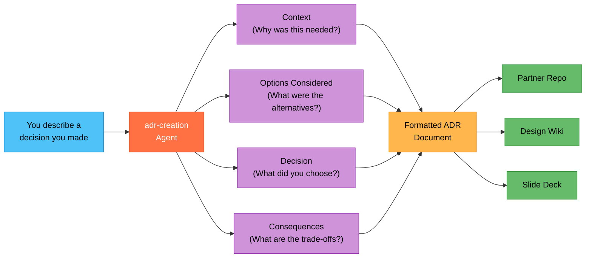

## What You Will Learn

How to turn an architecture decision you made during a partner engagement into a formal, structured Architecture Decision Record (ADR) without writing one from scratch.

## The Problem

During a partner call, you recommended Azure OpenAI over a self-hosted model. The partner agreed and the team moved forward. Three weeks later, a new stakeholder joins and asks: "Why didn't we use an open-source model?" Nobody has a written record. You reconstruct the rationale from memory, hoping you remember the key trade-offs. This happens on every engagement.

## The Fix (2 Minutes)

1. Open Copilot Chat (`Cmd+Alt+I` on macOS, `Ctrl+Alt+I` on Windows).
2. In the agent picker, select **adr-creation**.
3. Describe the decision in your own words:

```text
We chose Azure OpenAI over a self-hosted Llama model for the partner's
customer support agent. The partner needs enterprise SLA guarantees,
built-in content filtering for compliance, and managed scaling. They
don't have a dedicated ML ops team to maintain a self-hosted deployment.
Cost was comparable given their expected volume.
```

4. The agent produces a structured ADR with all the standard sections.

## What You Get

The agent generates a complete ADR following a standard template:

* Title and date
* Status (proposed, accepted, deprecated, superseded)
* Context explaining the business and technical situation
* Options considered with pros and cons for each
* The decision itself, stated clearly
* Consequences (both benefits and trade-offs)

You can paste this directly into a partner's repo, a design document, or a shared wiki.

## How the ADR Process Works



One plain-English description in, one structured decision record out, shareable across multiple deliverables.

## More Examples for Common PSA Decisions

Adapt the prompt to whatever decision your engagement required:

```text
We chose Azure Cosmos DB over Azure SQL for the partner's chat history
store. The data is semi-structured (varying message schemas), the app
needs single-digit millisecond reads globally, and the partner plans
to expand to multiple regions. SQL would require more schema management
overhead for this use case.
```

```text
We chose Microsoft Agent Framework over Semantic Kernel for the partner's
multi-agent orchestration. The partner needs built-in tool calling,
structured agent handoffs, and deployment to Foundry Agent Services.
MAF provides these out of the box while SK would require custom
orchestration code.
```

```text
We chose Azure AI Search over a vector-only database like Pinecone for
RAG retrieval. The partner needs hybrid search (keyword + vector),
built-in document cracking for PDFs, and tight integration with Azure
OpenAI. Keeping everything in Azure simplifies networking and compliance.
```

## Why This Matters

| Writing ADRs Manually | adr-creation Agent |
|---|---|
| 20-30 minutes per decision | 2 minutes per decision |
| Often skipped due to time pressure | Low effort means it actually gets done |
| Inconsistent format across engagements | Standard template every time |
| Only captures what you remember to write | Agent prompts you for missing sections |

> [!TIP]
> Make ADR creation a habit: after every significant architecture decision in a partner engagement, spend 2 minutes with the `adr-creation` agent. Over time, you build a reusable library of decisions that helps you and your team on future engagements with similar trade-offs.

## Next Steps

* Try [Quick Start 5: Build a Partner Demo Dashboard in 5 Minutes](hve-quick-start-5-demo-dashboard.md) to create a live demo for your partner.
* Return to the [Quick Start Series README](README.md) for the full learning path.

---

*Part 4 of 7 in the HVE Quick Start series for Partner Solutions Architects*
