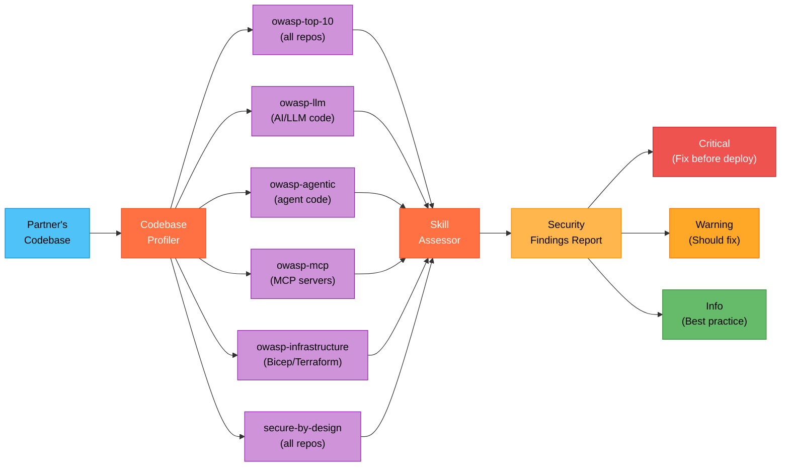

## What You Will Learn

How to run a security-focused review of a partner's code or architecture before it goes to production, catching common vulnerabilities without being a security specialist yourself.

## The Problem

A partner is ready to deploy their Azure AI application to production. Before go-live, someone needs to review the code for security issues: hardcoded secrets, missing authentication, open endpoints, prompt injection risks in their AI layer. You are not a security engineer, and hiring one for a PoC review is overkill. But letting obvious issues slip through hurts the partner's trust and your credibility.

## The Fix (5 Minutes)

1. Open the partner's project in VS Code with HVE Core installed.
2. Open Copilot Chat (`Cmd+Alt+I` on macOS, `Ctrl+Alt+I` on Windows).
3. In the agent picker, select **Security Planner**.
4. Trigger the review with a single prompt:

```text
Analyse the code and produce a vulnerability report.
```

5. The agent profiles the codebase, selects the right OWASP skill set automatically, runs each assessment, and returns severity-graded findings.

> [!TIP]
> You can target a specific skill if you know what you need:
> `analyse the code and produce a vulnerability report targetSkill=owasp-mcp`

## How the Security Review Works

The **Security Planner** orchestrates a multi-agent pipeline. It does not require you to know which OWASP checks apply — the `Codebase Profiler` subagent detects what is in the repo and selects the right skills automatically.



One prompt in, a full multi-skill severity-graded report out — written to `.copilot-tracking/security/`.

## What Auto-Triggers Based on Your Partner's Stack

The Codebase Profiler detects file types and activates the right skills without any manual selection:

| Partner's Stack | Skills That Activate |
|---|---|
| Any repo | `owasp-top-10` (web app vulnerabilities), `secure-by-design` (UK Gov + ASD/ACSC principles) |
| Python/C# agent code (MAF, Foundry) | `owasp-agentic` (agent-specific risks) |
| Azure OpenAI, RAG pipelines | `owasp-llm` (LLM-specific risks, prompt injection) |
| MCP server code | `owasp-mcp` (MCP tool exposure risks, tool poisoning) |
| `.bicep` or `.tf` files | `owasp-infrastructure` (IaC misconfigurations, public endpoints) |

## Common Security Issues the Review Catches

For Azure AI applications, the review typically flags:

* API keys or connection strings hardcoded in source (should use Azure Key Vault)
* Missing authentication on API endpoints exposed through App Service
* Azure OpenAI API keys passed in client-side code (should stay server-side)
* No input validation on user prompts before sending to Azure OpenAI (prompt injection risk)
* Overly permissive CORS settings on the web API
* Missing managed identity configuration (using keys instead of RBAC)
* Logging sensitive data (PII in chat histories, prompt content in application logs)
* MCP tools with overly broad permissions or missing input validation (tool poisoning risk)
* Public endpoints in Bicep/Terraform that should use Private Endpoints
* Missing network security groups or overly permissive RBAC on infrastructure

## More Examples for Common PSA Security Reviews

Adapt the prompt to the specific area you want to focus on:

```text
Review the authentication and authorization setup in this project.
The app uses Azure App Service with Easy Auth and calls Azure OpenAI.
Check that the auth flow is secure and that API keys are properly
managed through Key Vault.
```

```text
Review the RAG pipeline for data leakage risks. The app retrieves
documents from Azure AI Search and sends them to Azure OpenAI as
context. Check that document access control is enforced and that
sensitive content cannot leak through the AI responses.
```

```text
Review the Bicep infrastructure code for security misconfigurations.
Check for public endpoints that should be private, missing network
security groups, and overly permissive RBAC role assignments.
```

```text
This repo contains an MCP server that exposes tools to an AI agent.
Review it for MCP-specific risks: tool poisoning, excessive permissions,
lack of input validation on tool parameters, and missing rate limiting.
targetSkill=owasp-mcp
```

## Why This Matters

| No Security Review | With Security Review |
|---|---|
| Obvious vulnerabilities reach production | Critical issues caught before deploy |
| Partner loses trust if breached | Partner sees you add security value |
| You miss issues you are not trained to find | Agent checks OWASP Top 10, LLM, Agentic, MCP, and Infrastructure risks automatically |
| Security is an afterthought | Security becomes part of the delivery |
| IaC misconfigurations shipped to prod | Bicep/Terraform reviewed against OWASP Infrastructure Top 10 |

> [!IMPORTANT]
> This review is not a substitute for a professional security audit on high-sensitivity workloads. It catches common issues and enforces baseline security hygiene. For regulated industries (healthcare, finance), recommend the partner also engage a dedicated security review.

> [!TIP]
> Combine this with [Quick Start 6](hve-quick-start-6-iac-generator.md). When you generate IaC for the partner's environment, immediately follow up with a security review of the generated Bicep or Terraform to ensure the infrastructure is configured securely from day one.

## Next Steps

* You have completed the full HVE Quick Start series. You can now configure your tools, research topics, produce diagrams, document decisions, build demos, deploy infrastructure, and review security.
* Explore the full [HVE Core Use Cases for PSAs](hve-core-use-cases-for-psa.md) for advanced workflows including the RPI (Research, Plan, Implement) methodology, custom agent creation, and more.
* Return to the [Quick Start Series README](README.md) for the full learning path.

---

*Part 7 of 7 in the HVE Quick Start series for Partner Solutions Architects*
