## Overview

This series provides seven focused, beginner-friendly guides for Partner Solutions Architects (PSAs) to get productive with [HVE Core](https://github.com/microsoft/hve-core) quickly. Each guide solves a real daily problem, requires minimal effort, and produces an immediate, tangible result.

The full series takes under 25 minutes. You can work through them in order or jump to whichever fits your current need.

## Prerequisites

* VS Code with the [HVE Core extension](https://marketplace.visualstudio.com/items?itemName=ise-hve-essentials.hve-core) installed
* GitHub Copilot active in VS Code

## The Learning Path

The seven quick starts follow a natural progression through a partner engagement:

```mermaid
graph LR
    subgraph phase1 ["Configure → Learn → Visualize"]
        QS1["1. Memory\n(30 sec)"] --> QS2["2. Researcher\n(2 min)"]
        QS2 --> QS3["3. Architecture\nDiagram (3 min)"]
    end

    subgraph phase2 ["Document → Demo → Deploy"]
        QS4["4. ADR\n(2 min)"] --> QS5["5. Demo\nDashboard (5 min)"]
        QS5 --> QS6["6. IaC\nGenerator (5 min)"]
    end

    subgraph phase3 ["Secure"]
        QS7["7. Security\nReview (5 min)"]
    end

    QS3 --> QS4
    QS6 --> QS7

    style phase1 fill:#E3F2FD,stroke:#1E88E5,color:#000
    style phase2 fill:#FFF3E0,stroke:#FB8C00,color:#000
    style phase3 fill:#FFEBEE,stroke:#E53935,color:#000
    style QS1 fill:#4FC3F7,stroke:#0288D1,color:#000
    style QS2 fill:#4FC3F7,stroke:#0288D1,color:#000
    style QS3 fill:#4FC3F7,stroke:#0288D1,color:#000
    style QS4 fill:#FFB74D,stroke:#FB8C00,color:#000
    style QS5 fill:#FFB74D,stroke:#FB8C00,color:#000
    style QS6 fill:#FFB74D,stroke:#FB8C00,color:#000
    style QS7 fill:#EF5350,stroke:#C62828,color:#fff
```

## Quick Start Guides

| # | Guide | What You Do | What You Get | Time |
|---|---|---|---|---|
| 1 | [Set Your Context Once](hve-quick-start-1-memory.md) | Tell Copilot who you are | Persistent context forever | 30 sec |
| 2 | [Prep for a Partner Call](hve-quick-start-2-researcher.md) | Ask a technical question | Structured briefing | 2 min |
| 3 | [Turn Your Whiteboard into a Diagram](hve-quick-start-3-architecture-diagram.md) | Describe an architecture | Shareable Mermaid diagram | 3 min |
| 4 | [Document Your Architecture Decisions](hve-quick-start-4-adr.md) | Describe a decision you made | Formal decision record | 2 min |
| 5 | [Build a Partner Demo Dashboard](hve-quick-start-5-demo-dashboard.md) | Describe what to demo | Runnable Streamlit app | 5 min |
| 6 | [Scaffold Azure Resources as Code](hve-quick-start-6-iac-generator.md) | Describe Azure resources needed | Deployable Bicep/Terraform | 5 min |
| 7 | [Review Code for Security](hve-quick-start-7-security-review.md) | Point at partner code | Severity-graded security findings | 5 min |

## Phase 1: Configure, Learn, Visualize

These three guides get you set up and producing your first deliverable:

* **Quick Start 1** configures your persistent identity so every Copilot interaction knows your role, stack, and partner context.
* **Quick Start 2** shows you how to research any Azure AI topic in 2 minutes instead of 30, getting a structured briefing instead of a pile of browser tabs.
* **Quick Start 3** turns plain English descriptions into professional architecture diagrams that render in GitHub, VS Code, and partner documents.

## Phase 2: Document, Demo, Deploy

These three guides produce partner-facing deliverables:

* **Quick Start 4** captures architecture decisions (Azure OpenAI vs. self-hosted, Cosmos DB vs. SQL) in a standard format so the rationale is never lost.
* **Quick Start 5** generates runnable demo dashboards you can screenshare with partners, turning "let me explain" into "let me show you."
* **Quick Start 6** scaffolds the Azure infrastructure your partner needs as deployable Bicep or Terraform, teaching IaC best practices from day one.

## Phase 3: Secure

The final guide ensures quality before go-live:

* **Quick Start 7** reviews the partner's code and infrastructure for OWASP Top 10 vulnerabilities, AI-specific risks like prompt injection, and common Azure security misconfigurations. Catching these before production protects the partner and your credibility.

## Going Deeper

After completing this series, explore the comprehensive guide covering all HVE Core capabilities for PSAs:

* [HVE Core Use Cases for PSAs](hve-core-use-cases-for-psa.md) covers the full RPI (Research, Plan, Implement) workflow, 15+ agents, custom agent creation, coding standards by stack, and project management tools.

## Key Links

| Resource | URL |
|---|---|
| HVE Core Repository | [github.com/microsoft/hve-core](https://github.com/microsoft/hve-core) |
| HVE Core Documentation | [microsoft.github.io/hve-core](https://microsoft.github.io/hve-core/) |
| VS Code Extension | [Marketplace](https://marketplace.visualstudio.com/items?itemName=ise-hve-essentials.hve-core) |
| Getting Started Guide | [Installation](https://github.com/microsoft/hve-core/blob/main/docs/getting-started/README.md) |

---

*HVE Quick Start Series for Partner Solutions Architects, March 2026*
