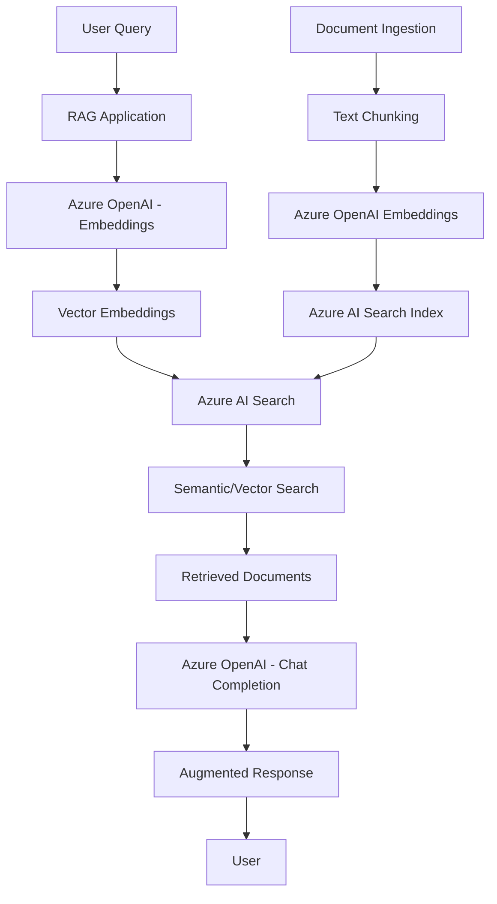

# Azure AI Search + Azure OpenAI RAG Integration Research

## Current SDK Versions (as of January 2025)

### Python SDKs
- **azure-search-documents**: 11.6.0
- **openai**: 2.29.0 (supports Azure OpenAI)
- **azure-ai-inference**: Latest stable for Azure AI services

## Architecture Overview



## Key Components Integration

### 1. Embedding Generation
Azure OpenAI provides embedding models (text-embedding-ada-002, text-embedding-3-small, text-embedding-3-large) that create vector representations of documents and queries.

### 2. Vector Storage & Search
Azure AI Search stores these embeddings and performs:
- **Vector Search**: Pure similarity search using embeddings
- **Hybrid Search**: Combines vector search with traditional keyword search
- **Semantic Search**: Uses Microsoft's semantic understanding models

### 3. RAG Pipeline
1. **Indexing Phase**: Documents → Chunks → Embeddings → Azure AI Search Index
2. **Query Phase**: Query → Embedding → Search → Context Retrieval → LLM Generation

## Current Limitations

### Azure AI Search Limitations
- **Vector dimensions**: Max 3,072 dimensions per vector field
- **Index size**: 15 GB per search unit (Basic), scaling with service tier
- **Query complexity**: Limited to 1024 characters for search queries
- **Vector field limits**: Max 5 vector fields per index (as of current version)
- **Batch size**: Max 1000 documents per indexing batch

### Azure OpenAI Limitations
- **Rate limits**: Vary by deployment tier (TPM - Tokens Per Minute)
- **Context window**: Model-dependent (4K-128K tokens)
- **Regional availability**: Limited to specific Azure regions
- **Embedding model limits**: 
  - text-embedding-ada-002: 8,191 input tokens
  - text-embedding-3-small/large: 8,191 input tokens

### Integration Limitations
- **Latency**: Two API calls (embedding + search, then completion)
- **Cost**: Embedding costs + search costs + completion costs
- **Data residency**: Must consider where data is processed/stored
- **Token limits**: Total context (retrieved docs + query) must fit in model window

## Recommended Indexing Strategies

### 1. Document Chunking Strategy
```python
# Recommended chunk sizes by use case
CHUNK_SIZES = {
    "general_qa": {"size": 1000, "overlap": 200},
    "code_docs": {"size": 1500, "overlap": 300},
    "legal_docs": {"size": 800, "overlap": 150},
    "technical_specs": {"size": 1200, "overlap": 250}
}
```

### 2. Index Schema Design
```python
# Optimal field configuration
index_schema = {
    "name": "documents-index",
    "fields": [
        {"name": "id", "type": "Edm.String", "key": True},
        {"name": "content", "type": "Edm.String", "searchable": True},
        {"name": "title", "type": "Edm.String", "searchable": True},
        {"name": "content_vector", "type": "Collection(Edm.Single)", 
         "dimensions": 1536, "vectorSearchProfile": "vector-profile"},
        {"name": "category", "type": "Edm.String", "filterable": True},
        {"name": "timestamp", "type": "Edm.DateTimeOffset", "filterable": True}
    ]
}
```

### 3. Search Configuration
```python
# Hybrid search configuration
search_config = {
    "vector_search": {
        "profiles": [{
            "name": "vector-profile",
            "algorithm": "hnsw",
            "vectorizer": "openai-vectorizer"
        }],
        "algorithms": [{
            "name": "hnsw",
            "kind": "hnsw",
            "hnswParameters": {
                "metric": "cosine",
                "m": 4,
                "efConstruction": 400,
                "efSearch": 500
            }
        }]
    }
}
```

### 4. Query Optimization
- **Use hybrid search**: Combine vector + keyword search for better recall
- **Apply filters**: Use filterable fields to narrow search scope
- **Optimize k value**: Start with k=3-5 for most use cases
- **Implement re-ranking**: Use semantic search for improved relevance

## Best Practices

### Performance Optimization
1. **Batch operations**: Process documents in batches of 100-1000
2. **Async operations**: Use async/await for concurrent API calls
3. **Caching**: Cache embeddings for frequently accessed content
4. **Connection pooling**: Reuse HTTP connections

### Cost Optimization
1. **Right-size embeddings**: Use text-embedding-3-small when sufficient
2. **Optimize chunk sizes**: Balance retrieval quality vs. embedding costs
3. **Filter before search**: Reduce search operations with pre-filtering
4. **Monitor usage**: Track token consumption and search operations

### Security & Compliance
1. **Network isolation**: Use private endpoints where possible
2. **Access control**: Implement RBAC and API key rotation
3. **Data encryption**: Enable encryption at rest and in transit
4. **Audit logging**: Enable diagnostic logging for compliance

## Sample Implementation Pattern

```python
from azure.search.documents import SearchClient
from openai import AzureOpenAI
import asyncio

class AzureRAGService:
    def __init__(self):
        self.search_client = SearchClient(...)
        self.openai_client = AzureOpenAI(...)
    
    async def query_rag(self, query: str, k: int = 5):
        # Generate query embedding
        embedding = await self.get_embedding(query)
        
        # Hybrid search
        results = self.search_client.search(
            search_text=query,
            vector_queries=[{
                "vector": embedding,
                "k_nearest_neighbors": k,
                "fields": "content_vector"
            }],
            select=["content", "title"],
            top=k
        )
        
        # Prepare context
        context = "\n".join([doc["content"] for doc in results])
        
        # Generate response
        response = await self.openai_client.chat.completions.create(
            model="gpt-4",
            messages=[
                {"role": "system", "content": "Use the context to answer questions."},
                {"role": "user", "content": f"Context: {context}\n\nQuestion: {query}"}
            ]
        )
        
        return response.choices[0].message.content
```

## Monitoring & Troubleshooting

### Key Metrics
- Search latency and throughput
- Embedding generation time
- Token consumption rates
- Search relevance scores
- Error rates and types

### Common Issues
1. **High latency**: Often due to large context windows or inefficient chunking
2. **Poor relevance**: May need better chunking strategy or hybrid search tuning
3. **Rate limiting**: Implement exponential backoff and request queuing
4. **Cost overruns**: Monitor token usage and optimize chunk sizes

This research provides a comprehensive overview of Azure AI Search + Azure OpenAI RAG integration with current technical specifications and best practices.