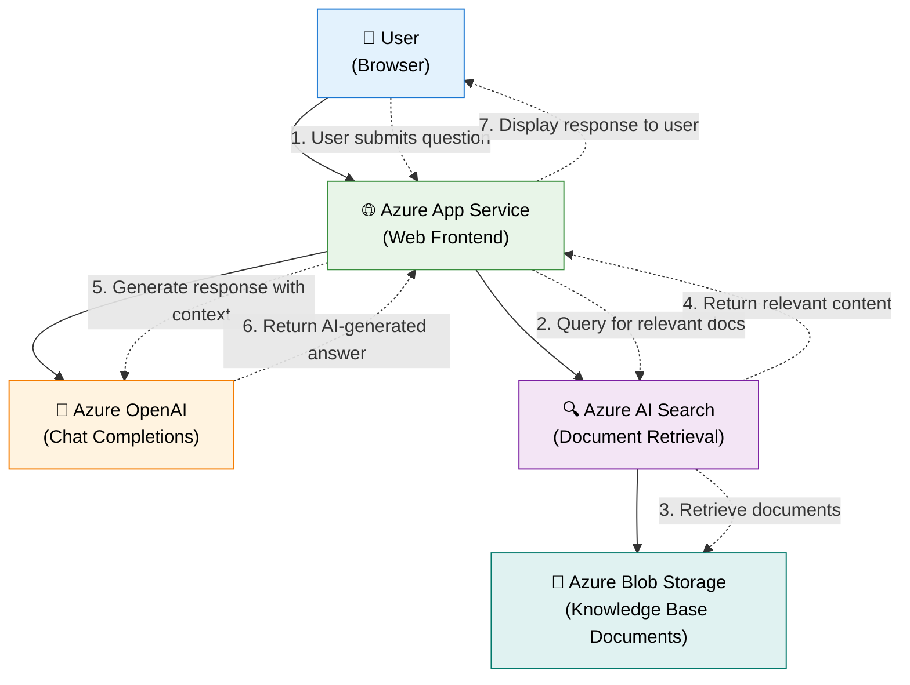
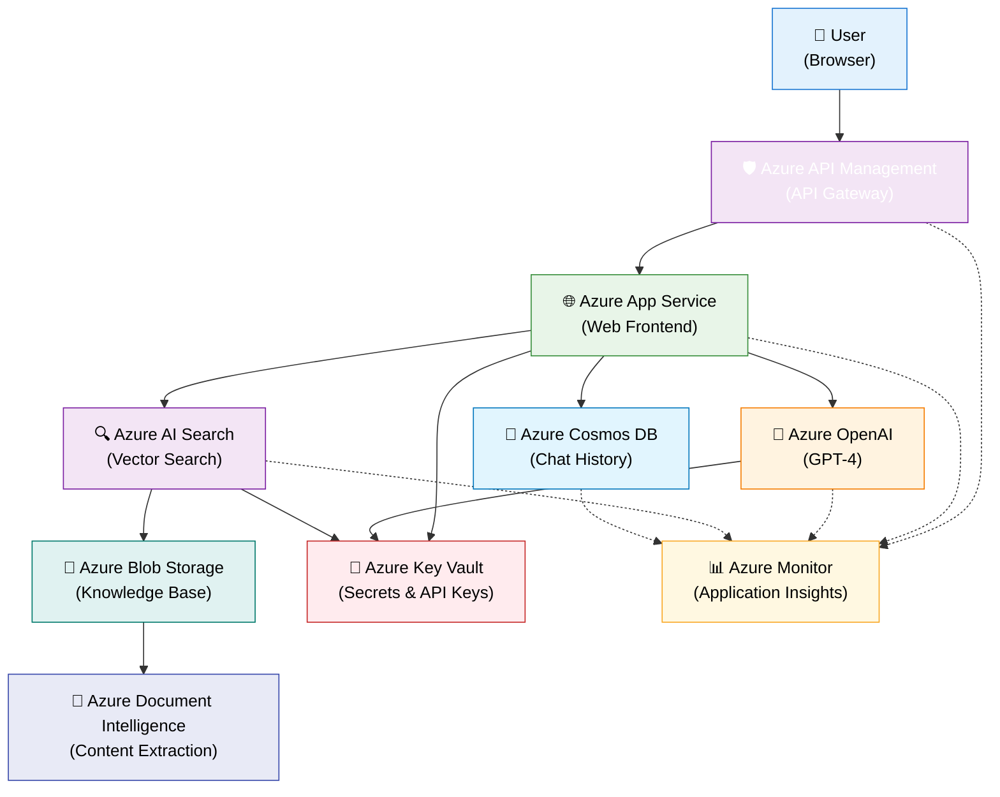

# Customer Support App Architecture Diagram

## Overview

This document contains the architecture diagram for a partner's customer support application that leverages Azure AI services to provide intelligent document retrieval and chat completions through a RAG (Retrieval-Augmented Generation) pattern.

## Architecture Components

- **Browser**: User interface for customer support interactions
- **Azure App Service**: Hosts the web frontend application
- **Azure OpenAI**: Provides chat completions and natural language understanding
- **Azure AI Search**: Enables document retrieval with semantic search capabilities
- **Azure Blob Storage**: Stores knowledge base documents (PDFs, manuals, FAQs)

## Basic Architecture Diagram

## Production-Ready Architecture Diagram

For a production deployment, here's an enhanced version with additional Azure services:

## Component Details

### Core Components (Basic Architecture)

| Component | Purpose | Key Features |
|-----------|---------|--------------|
| **Browser (User Interface)** | Customer-facing interface | Interactive chat UI, document upload, search history |
| **Azure App Service** | Web application hosting | Managed hosting, auto-scaling, SSL certificates |
| **Azure OpenAI** | AI chat completions | GPT-4 models, natural language understanding, contextual responses |
| **Azure AI Search** | Document retrieval | Semantic search, vector indexing, relevance scoring |
| **Azure Blob Storage** | Knowledge base storage | Scalable file storage, hierarchical organization, lifecycle management |

### Enhanced Components (Production Architecture)

| Component | Purpose | Key Features |
|-----------|---------|--------------|
| **Azure API Management** | API gateway and security | Rate limiting, authentication, API versioning, analytics |
| **Azure Cosmos DB** | Chat history storage | Global distribution, multi-model database, real-time analytics |
| **Azure Key Vault** | Security and secrets management | Encrypted secret storage, access policies, compliance |
| **Azure Monitor** | Observability and monitoring | Application insights, performance metrics, alerting |
| **Azure Document Intelligence** | Content extraction | OCR, form recognition, structured data extraction |

The application implements the Retrieval-Augmented Generation (RAG) pattern:

1. **User Query**: Customer submits a support question through the browser
2. **Document Search**: App Service queries Azure AI Search for relevant documents
3. **Content Retrieval**: Azure AI Search retrieves matching content from Blob Storage
4. **Context Preparation**: Retrieved documents provide context for the AI response
5. **AI Generation**: Azure OpenAI generates a response based on the query and retrieved context
6. **Response Delivery**: The AI-generated answer is returned to the user through the web interface

## Key Benefits

- **Scalable Knowledge Base**: Azure Blob Storage can handle large volumes of documents
- **Semantic Search**: Azure AI Search provides intelligent document retrieval beyond keyword matching
- **Natural Language Responses**: Azure OpenAI generates human-like responses based on company knowledge
- **Web-Based Access**: Azure App Service provides a scalable, managed hosting environment
- **Cost-Effective**: Pay-as-you-go pricing model for all Azure services

## Technical Considerations

- **Authentication**: Implement Azure AD integration for secure access
- **Monitoring**: Add Azure Application Insights for performance tracking
- **Caching**: Consider Redis cache for frequently accessed content
- **Security**: Use Azure Key Vault for managing API keys and secrets
- **Backup**: Implement backup strategies for critical knowledge base content