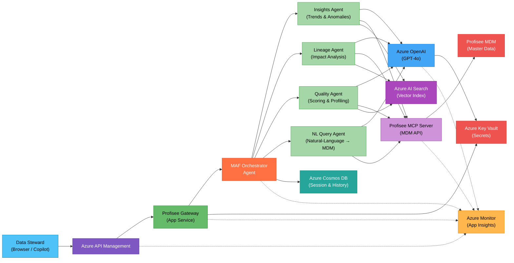
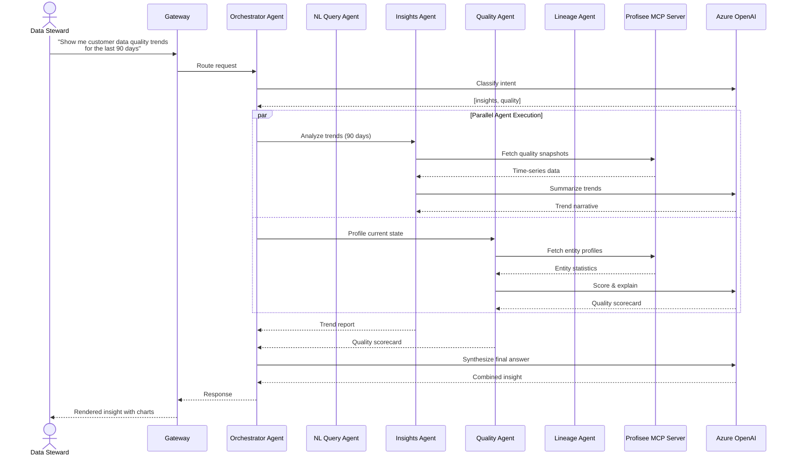
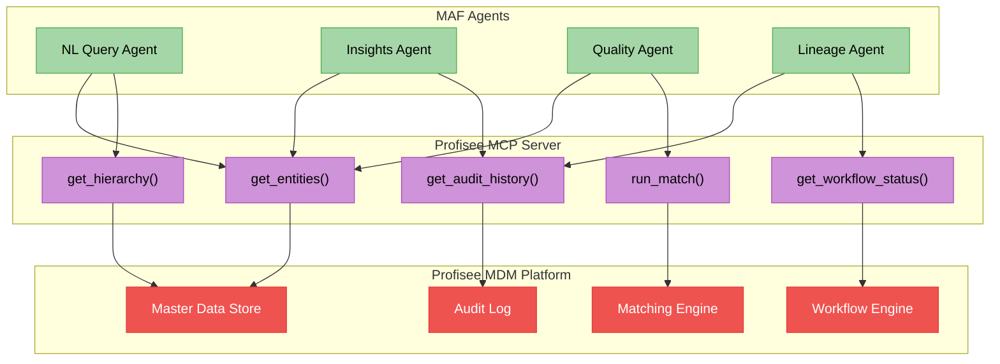
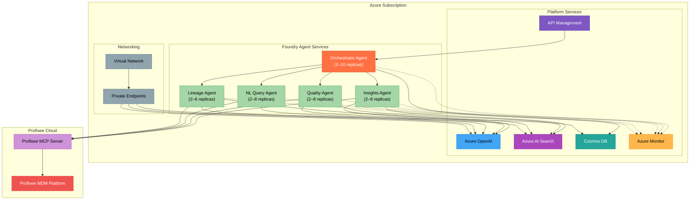

# PROFISEE MDM Insights — Multi-Agent Architecture Diagram

**Partner**: PROFISEE
**Use Case**: AI-Driven Insights into Master Data Management Content
**Technologies**: Microsoft Agent Framework (MAF), Foundry Agent Services, Azure AI Services
**Date**: March 2026
**PSA**: Arturo Quiroga

---

## High-Level Architecture

Solid lines → primary data flow. Dashed lines → telemetry / observability.

---

## Detailed Agent Interaction Flow

---

## Agent Responsibilities

| Agent | Purpose | Key Tools |
|-------|---------|-----------|
| **Orchestrator** | Intent classification, agent routing, response synthesis | Azure OpenAI |
| **NL Query Agent** | Translates natural-language questions into Profisee MDM API calls | Profisee MCP Server, Azure OpenAI |
| **Insights Agent** | Trend detection, anomaly analysis, predictive summaries | Profisee MCP Server, AI Search, Azure OpenAI |
| **Quality Agent** | Data profiling, completeness/accuracy scoring, remediation advice | Profisee MCP Server, AI Search, Azure OpenAI |
| **Lineage Agent** | Impact analysis, dependency mapping, change propagation tracking | Profisee MCP Server, AI Search, Azure OpenAI |

---

## Profisee MCP Server Integration

The **Profisee MCP Server** is the single gateway through which all agents access MDM content. It exposes Profisee's REST API as MCP-compatible tool functions, enabling:

- **Entity CRUD** — read/write master data records
- **Hierarchy traversal** — navigate parent-child relationships
- **Match/merge operations** — invoke Profisee's matching engine
- **Workflow status** — query stewardship workflow states
- **Audit history** — retrieve change logs for lineage analysis

---

## Azure Services Summary

| Service | Role |
|---------|------|
| **Azure OpenAI (GPT-4o)** | LLM reasoning for all agents |
| **Azure AI Search** | Vector index over MDM metadata for semantic retrieval |
| **Azure Cosmos DB** | Conversation history, cached insights, session state |
| **Azure API Management** | Auth, rate-limiting, routing |
| **Azure Key Vault** | Secrets & certificates |
| **Azure Monitor / App Insights** | Distributed tracing, agent metrics, alerting |
| **Foundry Agent Services** | MAF agent hosting, scaling, lifecycle management |

---

## Deployment Topology

---

*Architecture diagram for PROFISEE's MAF-based multi-agent MDM insights system. Render in VS Code Markdown preview or any Mermaid-compatible viewer.*
