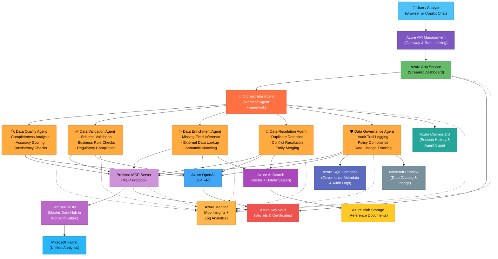

# Profisee MDM Multi-Agent System — Architecture Diagram

> Generated 2026-03-20 · Microsoft Agent Framework (MAF) on Azure AI Foundry Agent Services

## System Overview

A multi-agent architecture that provides AI-driven insights into Profisee's Master Data Management (MDM) system. An orchestrator agent routes user queries to five specialized agents, each focused on a distinct MDM concern. Profisee's MCP Server enables direct connectivity between agents and the MDM platform.

## Architecture Diagram

## Data Flow

| Flow | Path | Description |
|------|------|-------------|
| **User Query** | User → APIM → App Service → Orchestrator | Natural-language question about master data quality, duplicates, compliance, etc. |
| **Agent Routing** | Orchestrator → Specialized Agent | MAF orchestrator classifies intent and delegates to the appropriate agent |
| **MDM Access** | Agent → Profisee MCP Server → Profisee MDM | Agents read/write master data via Profisee's MCP protocol |
| **LLM Reasoning** | Agent → Azure OpenAI (GPT-4o) | Each agent uses GPT-4o for analysis, summarization, and recommendations |
| **RAG Retrieval** | Agent → Azure AI Search → Blob Storage | Enrichment & Resolution agents retrieve reference data for matching |
| **Persistence** | Orchestrator → Cosmos DB | Session history and agent state stored for continuity |
| **Governance** | Governance Agent → Azure SQL / Purview | Audit logs, policy metadata, and data lineage captured |
| **Observability** | All agents -.-> Azure Monitor | Telemetry, traces, and logs via Application Insights |

## Agent Responsibilities

| Agent | Primary Function | Key Insights Provided |
|-------|-----------------|----------------------|
| **Data Quality** | Analyze completeness, accuracy, consistency | "47 customer records are missing postal codes; overall completeness is 92%" |
| **Data Validation** | Enforce schema and business rules | "12 records violate the email format rule; 3 fail regulatory address requirements" |
| **Data Enrichment** | Fill gaps using AI and external sources | "Inferred 31 missing industry codes from company descriptions with 94% confidence" |
| **Data Resolution** | Detect and merge duplicates | "Found 8 potential duplicate clusters across 23 records; recommended merge strategy ready" |
| **Data Governance** | Track lineage, audit, and compliance | "All changes since March 1 are fully audited; 2 policy violations flagged for review" |

## Technology Stack

| Layer | Technology | Purpose |
|-------|-----------|---------|
| Agent Framework | Microsoft Agent Framework (MAF) | Multi-agent orchestration and tool calling |
| Hosting | Azure AI Foundry Agent Services | Managed agent runtime |
| LLM | Azure OpenAI (GPT-4o) | Reasoning, analysis, summarization |
| Search | Azure AI Search (vector + hybrid) | RAG retrieval for enrichment and resolution |
| MDM Platform | Profisee (in Microsoft Fabric) | Master data hub |
| MDM Connectivity | Profisee MCP Server | MCP protocol bridge to MDM APIs |
| Data Stores | Cosmos DB, Azure SQL, Blob Storage | State, governance metadata, documents |
| Governance | Microsoft Purview | Data catalog and lineage |
| Analytics | Microsoft Fabric | Unified analytics over master data |
| Security | Azure Key Vault, APIM | Secrets management, API gateway |
| Observability | Azure Monitor + App Insights | Logging, tracing, alerting |

## Performance Targets

| Metric | Target |
|--------|--------|
| Data completeness score | ≥ 95% |
| Data accuracy score | ≥ 98% |
| Record processing throughput | 10,000 records/hour |
| Agent response latency (P95) | < 5 seconds |
| Duplicate detection precision | ≥ 97% |

---

*Diagram follows the Mermaid format — renders in VS Code Markdown preview, GitHub, and most documentation platforms. Export to PNG/SVG via Mermaid CLI or VS Code extensions.*
