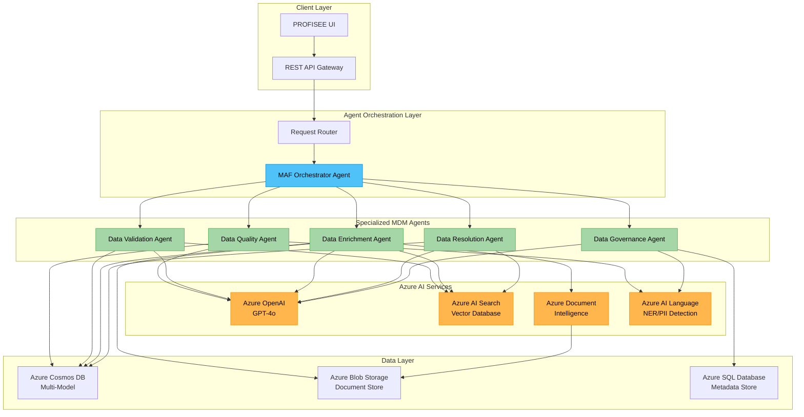

# PROFISEE Multi-Agent MDM System Architecture

**Partner**: PROFISEE  
**Use Case**: Multi-Agent System for Master Data Management  
**Technologies**: Microsoft Agent Framework (MAF), Microsoft Foundry Agent Services, Azure AI Services  
**Date**: March 2026  
**PSA**: Arturo Quiroga  

## Overview

This document outlines the architecture for PROFISEE's multi-agent Master Data Management (MDM) system built on Microsoft Agent Framework (MAF) and deployed through Microsoft Foundry Agent Services.

## Agent Architecture



## Agent Specifications

### 1. Data Quality Agent
**Purpose**: Analyze data quality issues and recommend remediation  
**MAF Configuration**:
```python
@agent(name="DataQualityAgent", version="1.0")
class DataQualityAgent(ConversableAgent):
    def __init__(self):
        super().__init__(
            name="DataQualityAgent",
            system_message="""You are a data quality specialist for MDM systems. 
            Analyze data for completeness, accuracy, consistency, and validity. 
            Provide actionable remediation recommendations.""",
            llm_config={"model": "gpt-4o", "temperature": 0.1}
        )
```

**Responsibilities**:
- Completeness analysis (missing fields, null values)
- Accuracy validation (format compliance, range validation)
- Consistency checks (cross-field validation, business rules)
- Duplicate detection and scoring
- Data quality metrics and scoring

### 2. Data Validation Agent  
**Purpose**: Validate data against business rules and schemas  
**MAF Configuration**:
```python
@agent(name="DataValidationAgent", version="1.0")  
class DataValidationAgent(ConversableAgent):
    def __init__(self):
        super().__init__(
            name="DataValidationAgent",
            system_message="""You are a data validation specialist. 
            Validate data records against defined schemas, business rules, 
            and regulatory compliance requirements.""",
            llm_config={"model": "gpt-4o", "temperature": 0.0}
        )
```

**Responsibilities**:
- Schema validation (data types, constraints)
- Business rule enforcement
- Regulatory compliance validation (GDPR, CCPA, industry standards)
- Cross-reference validation with external sources
- Validation result scoring and confidence levels

### 3. Data Enrichment Agent
**Purpose**: Enhance records with additional context and missing information  
**MAF Configuration**:
```python
@agent(name="DataEnrichmentAgent", version="1.0")
class DataEnrichmentAgent(ConversableAgent):
    def __init__(self):
        super().__init__(
            name="DataEnrichmentAgent", 
            system_message="""You are a data enrichment specialist. 
            Enhance master data records by finding and adding missing information 
            from internal and external sources.""",
            llm_config={"model": "gpt-4o", "temperature": 0.2}
        )
```

**Responsibilities**:
- Missing field inference and population
- External data source integration
- Semantic matching and entity resolution
- Hierarchical data completion (parent-child relationships)
- Confidence scoring for enriched data

### 4. Data Resolution Agent
**Purpose**: Resolve conflicts and merge duplicate entities  
**MAF Configuration**:
```python
@agent(name="DataResolutionAgent", version="1.0")
class DataResolutionAgent(ConversableAgent):
    def __init__(self):
        super().__init__(
            name="DataResolutionAgent",
            system_message="""You are a data resolution specialist. 
            Resolve conflicts between data sources and merge duplicate entities 
            while preserving data lineage and audit trails.""",
            llm_config={"model": "gpt-4o", "temperature": 0.1}
        )
```

**Responsibilities**:
- Duplicate detection and similarity scoring
- Conflict resolution between data sources
- Entity matching and merging strategies
- Data lineage preservation
- Survivorship rules application

### 5. Data Governance Agent
**Purpose**: Ensure compliance and audit trail management  
**MAF Configuration**:
```python
@agent(name="DataGovernanceAgent", version="1.0")
class DataGovernanceAgent(ConversableAgent):
    def __init__(self):
        super().__init__(
            name="DataGovernanceAgent",
            system_message="""You are a data governance specialist. 
            Ensure data compliance, manage audit trails, and enforce 
            data stewardship policies.""",
            llm_config={"model": "gpt-4o", "temperature": 0.0}
        )
```

**Responsibilities**:
- Audit trail generation and management
- Policy compliance monitoring  
- Data lineage tracking
- Stewardship workflow management
- Regulatory reporting

## Agent Communication Patterns

### Synchronous Workflow
```python
# Example: Customer record processing
async def process_customer_record(customer_data: dict) -> ProcessingResult:
    # 1. Data Quality Assessment
    quality_result = await data_quality_agent.analyze(customer_data)
    
    # 2. Validation (if quality passes threshold)
    if quality_result.score >= 0.7:
        validation_result = await data_validation_agent.validate(customer_data)
    
    # 3. Enrichment (if validation passes)
    if validation_result.is_valid:
        enriched_data = await data_enrichment_agent.enhance(customer_data)
    
    # 4. Resolution (check for duplicates)
    resolution_result = await data_resolution_agent.resolve(enriched_data)
    
    # 5. Governance (audit and compliance)
    audit_result = await data_governance_agent.audit(resolution_result)
    
    return ProcessingResult(
        processed_data=resolution_result.master_record,
        quality_score=quality_result.score,
        validation_status=validation_result.status,
        audit_id=audit_result.audit_id
    )
```

### Asynchronous Event-Driven
```python
# Event-driven processing for high-volume scenarios
@event_handler("data.received")
async def handle_data_received(event: DataReceivedEvent):
    # Queue for quality analysis
    await message_bus.publish("quality.analyze", event.data)

@event_handler("quality.completed")  
async def handle_quality_completed(event: QualityCompletedEvent):
    if event.score >= threshold:
        await message_bus.publish("validation.validate", event.data)

@event_handler("validation.completed")
async def handle_validation_completed(event: ValidationCompletedEvent):
    if event.is_valid:
        await message_bus.publish("enrichment.enhance", event.data)
        
# Continue chain through resolution and governance...
```

## Azure Service Integration

### Azure OpenAI Integration
```python
# Shared LLM configuration for all agents
AZURE_OPENAI_CONFIG = {
    "api_type": "azure",
    "api_base": "https://profisee-openai.openai.azure.com/",
    "api_version": "2024-02-01", 
    "api_key": os.getenv("AZURE_OPENAI_API_KEY"),
    "model": "gpt-4o",
    "deployment_name": "gpt-4o-profisee"
}
```

### Azure AI Search for Vector Storage
```python
# Vector embeddings for entity matching
SEARCH_CONFIG = {
    "service_name": "profisee-search",
    "api_key": os.getenv("AZURE_SEARCH_API_KEY"),
    "index_name": "master-data-entities",
    "embedding_model": "text-embedding-ada-002"
}
```

### Azure Cosmos DB Multi-Model
```python
# Master data storage with graph relationships
COSMOS_CONFIG = {
    "endpoint": "https://profisee-cosmos.documents.azure.com:443/",
    "key": os.getenv("COSMOS_DB_KEY"),
    "database": "ProfiseeMDM",
    "containers": {
        "entities": "MasterEntities",
        "relationships": "EntityRelationships", 
        "audit": "AuditTrail"
    }
}
```

## Deployment Architecture (Microsoft Foundry Agent Services)

### Agent Service Manifest
```yaml
apiVersion: foundry.microsoft.com/v1
kind: AgentService
metadata:
  name: profisee-mdm-agents
  namespace: profisee-prod
spec:
  agents:
    - name: data-quality-agent
      image: profisee.azurecr.io/mdm-agents:latest
      resources:
        requests:
          cpu: "500m"
          memory: "1Gi"
        limits:
          cpu: "2"
          memory: "4Gi"
      env:
        - name: AGENT_TYPE
          value: "DataQualityAgent"
    - name: data-validation-agent  
      image: profisee.azurecr.io/mdm-agents:latest
      resources:
        requests:
          cpu: "500m" 
          memory: "1Gi"
        limits:
          cpu: "2"
          memory: "4Gi"
      env:
        - name: AGENT_TYPE
          value: "DataValidationAgent"
    # Continue for other agents...
  scaling:
    minReplicas: 2
    maxReplicas: 10
    targetCPUUtilization: 70
  networking:
    service:
      type: LoadBalancer
      ports:
        - port: 8080
          targetPort: 8080
```

### Container Configuration
```dockerfile
# Dockerfile for MAF agents
FROM mcr.microsoft.com/dotnet/runtime:8.0
WORKDIR /app
COPY --from=build /app/out .

# Install MAF runtime
RUN dotnet add package Microsoft.AgentFramework.Runtime --version 1.0.0
RUN dotnet add package Microsoft.Azure.OpenAI --version 1.0.0
RUN dotnet add package Azure.Search.Documents --version 11.5.0

EXPOSE 8080
ENTRYPOINT ["dotnet", "ProfiseeMDMAgents.dll"]
```

## Performance & Scalability Considerations

### Agent Load Balancing
- Horizontal scaling based on queue depth
- Circuit breaker patterns for external dependencies
- Bulkhead isolation between agent types
- Rate limiting per tenant/customer

### Caching Strategy
- Redis cache for frequent entity lookups
- Vector cache for similarity computations  
- Model response caching for repeated queries
- Session state management

### Monitoring & Observability
- Application Insights integration
- Custom metrics per agent type
- Distributed tracing across agent calls
- Real-time quality score dashboards

## Security Architecture

### Authentication & Authorization
```python
# Azure AD integration for agent authentication
AUTHENTICATION_CONFIG = {
    "authority": "https://login.microsoftonline.com/profisee.onmicrosoft.com",
    "client_id": os.getenv("AZURE_CLIENT_ID"),
    "client_secret": os.getenv("AZURE_CLIENT_SECRET"),
    "scopes": ["https://foundry.microsoft.com/.default"]
}
```

### Data Protection
- Managed Identity for Azure service access
- Key Vault for secrets management  
- Customer-managed keys for data encryption
- Network security groups and private endpoints
- PII detection and redaction in audit logs

## Implementation Phases

### Phase 1: Core Agents (Weeks 1-4)
- Data Quality Agent implementation
- Data Validation Agent implementation  
- Basic orchestrator setup
- Azure service integration

### Phase 2: Advanced Processing (Weeks 5-8)
- Data Enrichment Agent implementation
- Data Resolution Agent implementation
- Vector search integration
- Performance optimization

### Phase 3: Governance & Production (Weeks 9-12)  
- Data Governance Agent implementation
- Full audit trail system
- Production deployment
- Performance monitoring

## Success Metrics

### Data Quality Metrics
- Data completeness improvement: Target 95%+
- Data accuracy improvement: Target 98%+  
- Duplicate reduction: Target 90%+
- Processing throughput: Target 10K records/hour

### System Performance
- Agent response time: < 2 seconds p95
- System availability: 99.9% uptime
- Error rate: < 0.1%
- Cost per processed record: Baseline + monitor

## Next Steps

1. **Development Environment Setup**
   - Azure subscription provisioning
   - MAF development environment
   - CI/CD pipeline configuration

2. **Proof of Concept**
   - Single agent implementation (Data Quality)
   - Sample data processing
   - Performance baseline establishment

3. **Iterative Development**
   - Agent-by-agent implementation
   - Integration testing
   - Performance optimization

4. **Production Readiness**
   - Security hardening
   - Monitoring implementation  
   - Documentation completion
   - User training

---

*This architecture document serves as the technical foundation for PROFISEE's multi-agent MDM system built on Microsoft Agent Framework and Azure AI Services.*