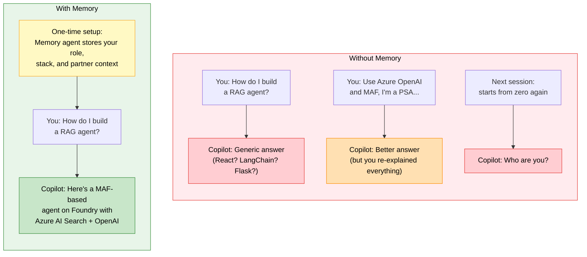

## What You Will Learn

How to tell GitHub Copilot who you are and what you do, once, so every future interaction is grounded in your role as a Partner Solutions Architect (PSA).

## The Problem

Every time you open Copilot Chat and ask a question, you start from zero. Copilot has no idea you work with partners, that you focus on Azure AI services, or that your agents use Microsoft Agent Framework. You end up repeating the same context over and over.

## The Fix (30 Seconds)

1. Open VS Code with HVE Core installed.
2. Open Copilot Chat (`Cmd+Alt+I` on macOS, `Ctrl+Alt+I` on Windows).
3. In the agent picker, select **Memory**.
4. Type the following (adjust to match your actual focus areas):

```text
Remember that I am a Partner Solutions Architect. I help partners build
apps and services on Azure AI services. My AI agents are built with
Microsoft Agent Framework (MAF) and Microsoft Foundry Agent Services
(pro code). I primarily work with Python and C#.
```

5. Press Enter. Done.

## What Happens Next

The Memory agent stores your context persistently. From this point forward, every HVE agent and Copilot interaction can reference this information. When you ask a question about Azure OpenAI SDK usage or request an architecture diagram, Copilot already knows your role, your stack, and your partner-facing context.

You can update your memory at any time by selecting the Memory agent again and adding new details:

```text
Remember that I'm currently working with a partner building a
document processing solution using Azure Document Intelligence
and Azure OpenAI.
```

## Before and After



## Why This Matters

| Without Memory | With Memory |
|---|---|
| Generic answers that ignore your role | Answers tailored to partner enablement |
| You re-explain your stack every session | Your stack is known automatically |
| Copilot suggests irrelevant frameworks | Copilot defaults to MAF, Foundry, Azure AI |

## Next Steps

* Try [Quick Start 2: Prep for a Partner Call in 5 Minutes](hve-quick-start-2-researcher.md) to see how your memory context improves research results.
* Explore the full [HVE Core Use Cases for PSAs](hve-core-use-cases-for-psa.md) when you are ready to go deeper.

---

*Part 1 of 3 in the HVE Quick Start series for Partner Solutions Architects*
