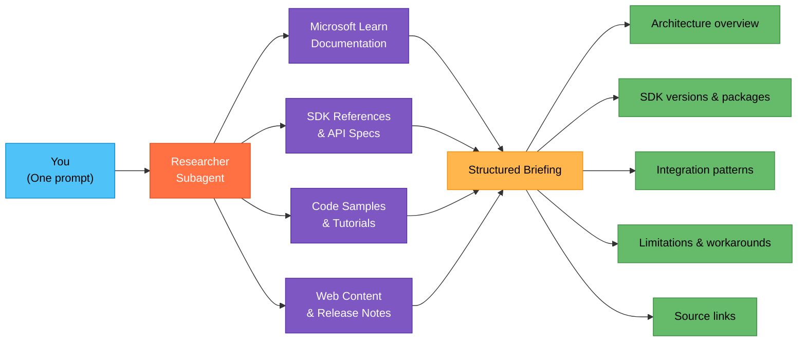

## What You Will Learn

How to use the Researcher subagent to get a structured technical briefing on any Azure AI topic before a partner call, instead of manually hunting through docs.

## The Problem

You have a partner call in 30 minutes. The partner wants to discuss integrating Azure AI Search with Azure OpenAI for a RAG pattern. You need to know the current SDK versions, key limitations, recommended architecture, and common pitfalls. Normally this means opening 6-10 browser tabs and scanning through documentation pages.

## The Fix (2 Minutes)

1. Open Copilot Chat (`Cmd+Alt+I` on macOS, `Ctrl+Alt+I` on Windows).
2. Type your research question in natural language:

```text
Research how Azure AI Search integrates with Azure OpenAI for a RAG
pattern. Include current SDK versions for Python, key limitations,
recommended indexing strategies, and a simple architecture overview.
```

3. The Researcher subagent searches official documentation, reads relevant pages, and returns a structured summary.

## Example Output You Can Expect

The researcher returns organized information, not a list of links. You get:

* A concise architecture overview with the key components and data flow
* Current SDK package names and versions
* Integration patterns (push vs. pull indexing, chunking strategies)
* Known limitations and workarounds
* Links to the specific documentation pages it referenced

## More Examples for Common PSA Scenarios

Adapt the prompt to whatever your next call is about:

```text
Research the differences between Azure OpenAI Assistants API and
Microsoft Agent Framework for building multi-turn conversational
agents. Which should a partner choose for a customer support bot?
```

```text
Research Azure Document Intelligence v4.0 capabilities for
extracting structured data from invoices and receipts. Include
supported file formats and accuracy considerations.
```

```text
Research how to deploy a Microsoft Agent Framework agent to
Foundry Agent Services. Include prerequisites, deployment steps,
and common configuration issues.
```

## How the Researcher Works



One prompt in, structured briefing out. The researcher handles the tab-hopping so you can focus on preparing your talking points.

## Why This Matters

| Manual Prep | Researcher Subagent |
|---|---|
| 30-60 minutes across multiple tabs | 2 minutes, one prompt |
| Unstructured notes you piece together | Organized summary ready to reference |
| Risk of outdated information | Pulls from current documentation |
| Hard to share with colleagues | Copy the output into a Teams message or email |

> [!TIP]
> If you completed [Quick Start 1](hve-quick-start-1-memory.md) and set up your Memory, the researcher already knows your role and stack. Your results will be more relevant to partner enablement scenarios.

## Next Steps

* Try [Quick Start 3: Turn Your Whiteboard into a Real Diagram](hve-quick-start-3-architecture-diagram.md) to produce a visual deliverable from your research.
* Return to the [Quick Start Series README](README.md) for the full learning path.
* Explore the full [HVE Core Use Cases for PSAs](hve-core-use-cases-for-psa.md) when you are ready to go deeper.

---

*Part 2 of 6 in the HVE Quick Start series for Partner Solutions Architects*
