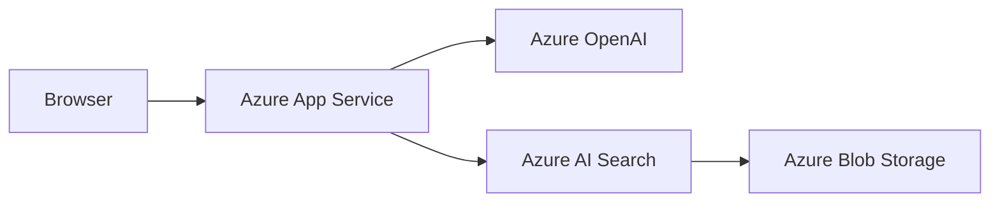
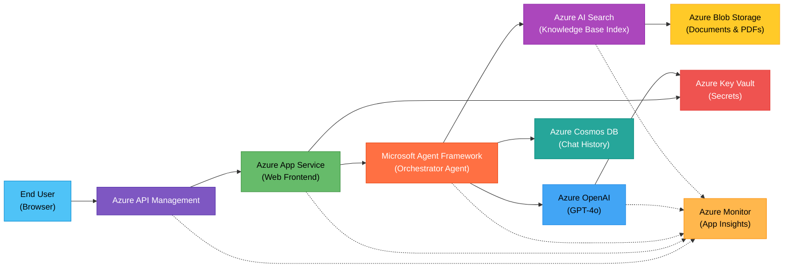

## What You Will Learn

How to describe a partner's architecture in plain English and get a professional diagram you can share in presentations, documents, and partner deliverables.

## The Problem

After a partner whiteboarding session, you have a mental picture of their architecture. Now you need to turn that into something shareable: a diagram for a slide deck, a design document, or an email summary. Manually recreating it in a diagramming tool takes 30-60 minutes you do not have.

## The Fix (3 Minutes)

1. Open Copilot Chat (`Cmd+Alt+I` on macOS, `Ctrl+Alt+I` on Windows).
2. In the agent picker, select **arch-diagram-builder**.
3. Describe the architecture in your own words:

```text
Create an architecture diagram for a partner's customer support app.
The app uses Azure OpenAI for chat completions, Azure AI Search for
document retrieval (RAG pattern), Azure Blob Storage for storing
knowledge base documents, and Azure App Service for hosting the
web frontend. Users interact through a browser.
```

4. The agent generates a Mermaid diagram that renders directly in VS Code.

## What You Get

The agent produces a Mermaid code block like this:

````text

````

VS Code renders this as a visual diagram in the Markdown preview. You can:

* Copy it into any markdown document for instant rendering
* Export it as an image (PNG/SVG) using a Mermaid CLI tool or VS Code extension
* Paste it into a partner-facing design document

## Example: RAG Customer Support App on Azure

Here is a full example of what the agent produces for a partner building a RAG-based customer support application. This started as a plain English description and was iteratively refined with follow-up requests ("add Azure Monitor for observability"):



Solid lines represent the primary data flow. Dashed lines represent telemetry and observability connections to Azure Monitor.

## More Examples for Common PSA Scenarios

Describe whatever architecture your partner is building:

```text
Create an architecture diagram for a document processing pipeline.
PDF documents are uploaded to Azure Blob Storage, triggering an
Azure Function that calls Azure Document Intelligence to extract
structured data. The extracted data is stored in Azure Cosmos DB
and surfaced through a Streamlit dashboard on Azure App Service.
```

```text
Create an architecture diagram for a multi-agent system built
with Microsoft Agent Framework on Foundry Agent Services. Show
an orchestrator agent that routes requests to a sales agent and
a support agent, each with access to Azure AI Search for their
respective knowledge bases.
```

## Refining Your Diagram

If the first diagram needs adjustments, ask in the same chat:

```text
Add Azure API Management between the browser and App Service.
Also add an Azure Key Vault connected to both App Service and
Azure OpenAI for secrets management.
```

The agent updates the diagram while preserving the existing structure.

## Why This Matters

| Manual Diagramming | arch-diagram-builder |
|---|---|
| 30-60 minutes in a drawing tool | 3 minutes in Copilot Chat |
| Requires knowing a diagramming tool | Describe in plain English |
| Hard to iterate quickly | Ask for changes conversationally |
| Static image, hard to update | Text-based, version-controllable |

> [!TIP]
> Combine this with [Quick Start 2](hve-quick-start-2-researcher.md). Research a topic first, then ask for an architecture diagram based on what the researcher found. The two agents complement each other naturally.

## Next Steps

* Try [Quick Start 4: Document Your Architecture Decisions in 2 Minutes](hve-quick-start-4-adr.md) to capture the decisions behind your designs.
* Return to the [Quick Start Series README](README.md) for the full learning path.
* Explore the full [HVE Core Use Cases for PSAs](hve-core-use-cases-for-psa.md) for advanced workflows including RPI (Research, Plan, Implement), custom agent creation, and more.

---

*Part 3 of 6 in the HVE Quick Start series for Partner Solutions Architects*
