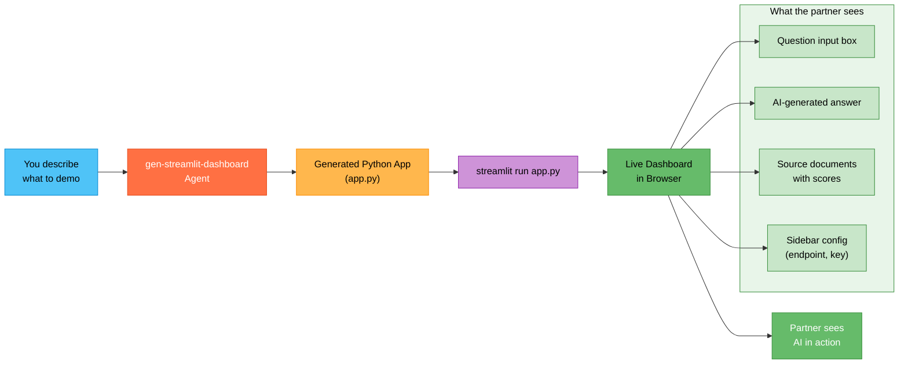

## What You Will Learn

How to generate a runnable demo dashboard from a plain English description, so your partner can see Azure AI in action instead of hearing about it on slides.

## The Problem

You have been explaining to a partner what Azure OpenAI and Azure AI Search can do together. They nod politely but ask: "Can you show me?" Building a demo means scaffolding a Python app, writing API calls, designing a basic UI, and handling error states. That is a half-day project minimum, and your next call is tomorrow.

## The Fix (5 Minutes)

1. Open Copilot Chat (`Cmd+Alt+I` on macOS, `Ctrl+Alt+I` on Windows).
2. In the agent picker, select **gen-streamlit-dashboard**.
3. Describe the demo you want to show:

```text
Create a Streamlit dashboard for a RAG demo. The user types a question
in a text input. The app sends the question to Azure AI Search to
retrieve relevant documents, then passes the question and retrieved
context to Azure OpenAI (GPT-4o) for an answer. Display the answer and
show the source documents with relevance scores below it. Add a sidebar
for configuring the Azure OpenAI endpoint and API key.
```

4. The agent generates a complete Python app. Save it and run:

```bash
pip install streamlit openai azure-search-documents
streamlit run app.py
```

5. Screenshare the running dashboard on your next partner call.

## From Description to Live Demo



Five minutes from description to a live demo your partner can interact with.

## More Examples for Common PSA Demos

Adapt the prompt to whatever you need to demonstrate:

```text
Create a Streamlit dashboard that lets a user upload a PDF, sends it
to Azure Document Intelligence for extraction, and displays the
extracted fields (invoice number, date, line items, totals) in a
clean table format.
```

```text
Create a Streamlit dashboard for comparing Azure OpenAI model outputs.
The user enters a prompt, and the app sends it to both GPT-4o and
GPT-4o-mini in parallel. Display both responses side by side with
token counts and latency for each.
```

```text
Create a Streamlit dashboard that shows a chatbot interface powered
by Microsoft Agent Framework. The user has a multi-turn conversation,
and the app displays the agent's reasoning steps alongside each
response to demonstrate transparency.
```

## Refining Your Demo

If the generated dashboard needs adjustments, ask in the same chat:

```text
Add a "Clear conversation" button and show a loading spinner while
waiting for the Azure OpenAI response. Also add token usage stats
at the bottom of each answer.
```

The agent updates the code while preserving the existing functionality.

## Why This Matters

| Building Demos Manually | gen-streamlit-dashboard |
|---|---|
| Half-day of coding and debugging | 5 minutes, one prompt |
| Requires knowing Streamlit, APIs, UI layout | Describe in plain English |
| Hard to iterate before a call | Ask for changes conversationally |
| Often deprioritized due to time | Low effort means demos happen more often |

> [!TIP]
> Combine this with [Quick Start 2](hve-quick-start-2-researcher.md). Research the Azure services first, then generate a demo that showcases what you learned. The research grounds the demo in accurate API usage.

## Next Steps

* Try [Quick Start 6: Scaffold Your Partner's Azure Environment as Code](hve-quick-start-6-iac-generator.md) to deploy the infrastructure your demo needs.
* Return to the [Quick Start Series README](README.md) for the full learning path.

---

*Part 5 of 6 in the HVE Quick Start series for Partner Solutions Architects*
