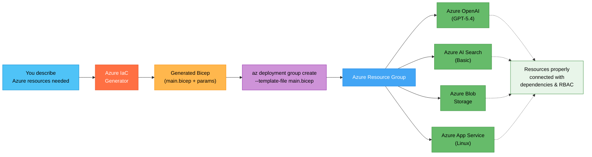

## What You Will Learn

How to describe the Azure resources your partner needs in plain English and get deployable Bicep or Terraform code, ready for `az deployment` or `terraform apply`.

## The Problem

The partner says "set up the Azure resources for our PoC." You could click through the portal, but that is not repeatable, not reviewable, and not how you should be teaching partners to work. Writing Bicep or Terraform from scratch requires knowing exact resource schemas, API versions, and dependency chains. That takes time you could spend on architecture and design.

## The Fix (5 Minutes)

1. Open Copilot Chat (`Cmd+Alt+I` on macOS, `Ctrl+Alt+I` on Windows).
2. In the agent picker, select **Azure IaC Generator**.
3. Describe the resources you need:

```text
Generate Bicep to provision an Azure OpenAI account with a GPT-4o
deployment, an Azure AI Search service (Basic tier), an Azure Blob
Storage account, and an App Service plan with a Linux web app.
All in East US 2, with a common resource group. Use parameters for
resource names and include proper resource dependencies.
```

4. The agent produces Bicep files with resource definitions, parameter files, and deployment commands.

## From Description to Deployed Infrastructure



Plain English in, deployable infrastructure out, with proper dependencies and configuration.

## More Examples for Common PSA Environments

Adapt the prompt to whatever Azure environment your partner needs:

```text
Generate Bicep for a RAG-based application environment: Azure OpenAI
with GPT--5.4 and text-embedding-3-small deployments, Azure AI Search
(Standard tier) with a semantic ranker enabled, Azure Cosmos DB for
chat history, and Azure Key Vault for secrets. Connect Key Vault to
all services using managed identities.
```

```text
Generate Terraform for a multi-agent platform: Azure OpenAI, Azure
AI Search, Azure Container Apps (for hosting the agent runtime),
Azure Cosmos DB, and Azure Monitor with Application Insights. Use
a virtual network with private endpoints for all services.
```

```text
Generate Bicep for a document processing pipeline: Azure Blob Storage
with an event trigger, Azure Functions (Python, Consumption plan),
Azure Document Intelligence, and Azure Cosmos DB for storing extracted
data. Include the storage event subscription that triggers the function.
```

## Refining Your Infrastructure

If the generated Bicep needs adjustments, ask in the same chat:

```text
Add Azure Monitor with Application Insights connected to the App
Service. Also add a Key Vault and configure managed identity access
from the App Service to both Key Vault and Azure OpenAI.
```

The agent updates the Bicep while preserving existing resource definitions and dependencies.

## Deploying the Generated Code

After review, deploy with a single command:

```bash
az deployment group create \
  --resource-group my-partner-poc-rg \
  --template-file main.bicep \
  --parameters main.bicepparam
```

For Terraform:

```bash
terraform init
terraform plan -out=tfplan
terraform apply tfplan
```

## Why This Matters

| Portal Clicking / Manual IaC | Azure IaC Generator |
|---|---|
| Not repeatable or reviewable | Code in source control, repeatable |
| Requires memorizing resource schemas | Describe in plain English |
| Easy to miss dependencies | Agent handles dependency chains |
| Partner learns portal, not best practices | Partner sees IaC from day one |

> [!TIP]
> Use this with [Quick Start 3](hve-quick-start-3-architecture-diagram.md). Generate an architecture diagram first to align on the design with the partner, then generate the IaC to provision exactly those resources. The diagram becomes the specification.

## Next Steps

* You have completed the full HVE Quick Start series. You can now configure your tools, research topics, produce diagrams, document decisions, build demos, and deploy infrastructure.
* Explore the full [HVE Core Use Cases for PSAs](hve-core-use-cases-for-psa.md) for advanced workflows including the RPI (Research, Plan, Implement) methodology, custom agent creation, and more.
* Return to the [Quick Start Series README](README.md) for the full learning path.

---

*Part 6 of 6 in the HVE Quick Start series for Partner Solutions Architects*
