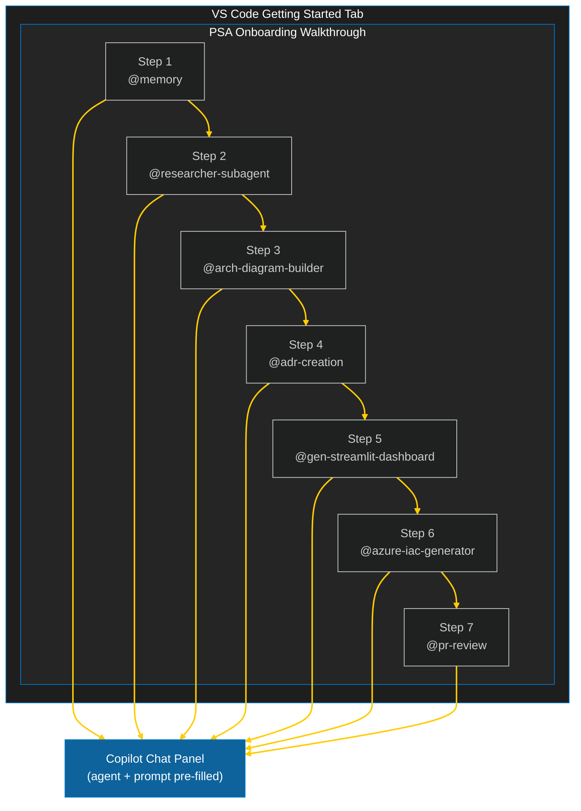
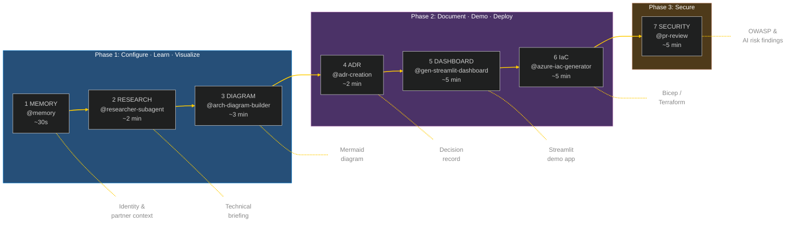
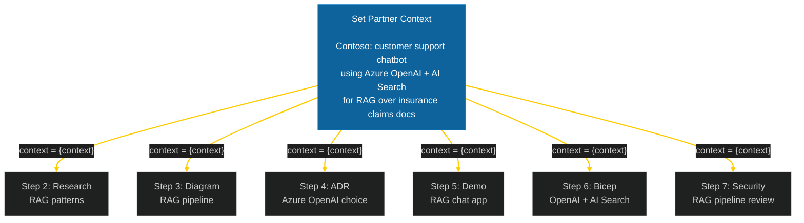
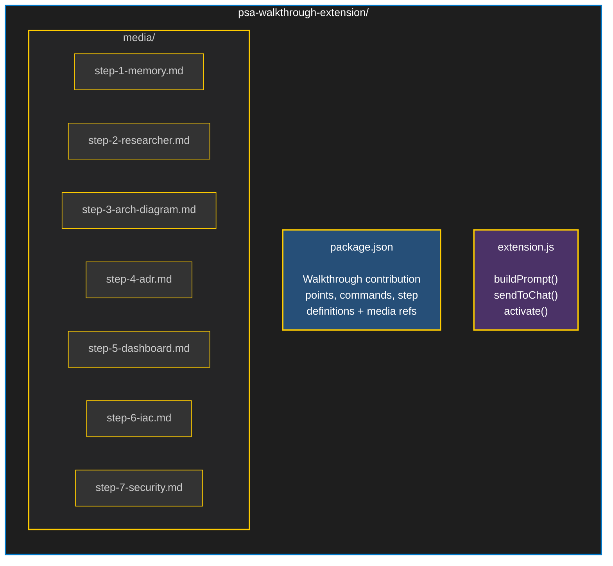
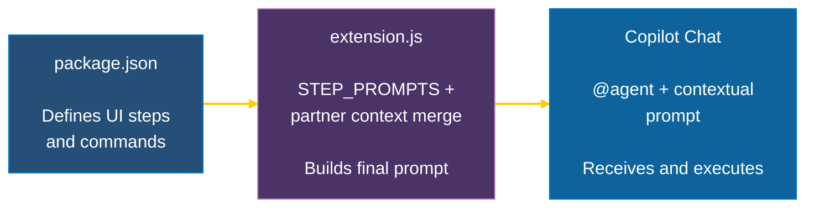
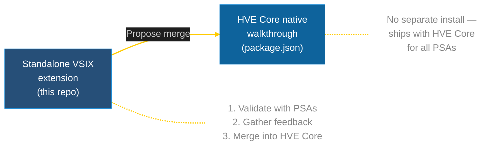

<!-- markdownlint-disable MD033 -->

<h1 align="center">HVE PSA Onboarding Walkthrough</h1>

<p align="center">
  <strong>From zero to partner-ready in seven AI-powered steps</strong><br/>
  A native VS Code walkthrough that puts GitHub Copilot agents to work for Partner Solutions Architects.
</p>

<p align="center">
  
  
  
  
</p>

---

## The Problem

Partner Solutions Architects juggle research, architecture diagrams, decision records, live demos, infrastructure code, and security reviews across dozens of tools. Preparing for a single partner engagement can take hours of context-switching.

## The Solution

This extension replaces that scattered workflow with a single guided walkthrough inside VS Code. Each step calls a specialized Copilot agent with a contextual prompt, and every step automatically threads your partner engagement context so the output is relevant from the start.

> [!TIP]
> Set your partner context once in Step 1, and all seven steps generate prompts tailored to your specific engagement instead of generic samples.

---

## How It Works



Each "Run" button opens Copilot Chat with the right agent and a starter prompt. Steps auto-complete when the command executes.

---

## The Seven Steps

The walkthrough follows three phases that mirror a typical partner engagement lifecycle:



### Phase 1: Configure, Learn, Visualize

| Step | Agent | You provide | You get |
|------|-------|-------------|---------|
| **1. Set Your Context** | `@memory` | Your role, tech stack, partner engagement | Persistent Copilot context that threads through every step |
| **2. Prep for a Partner Call** | `@researcher-subagent` | A topic or question | Structured briefing with SDK versions, limitations, recommendations |
| **3. Architecture Diagram** | `@arch-diagram-builder` | Plain English architecture description | Professional Mermaid diagram ready for docs or slides |

### Phase 2: Document, Demo, Deploy

| Step | Agent | You provide | You get |
|------|-------|-------------|---------|
| **4. Architecture Decision Record** | `@adr-creation` | A decision and its context | Formal ADR with alternatives, trade-offs, consequences |
| **5. Demo Dashboard** | `@gen-streamlit-dashboard` | Demo scenario description | Runnable Streamlit app with mock data and clean UI |
| **6. Infrastructure as Code** | `@azure-iac-generator` | Required Azure resources | Deployable Bicep with dependencies, naming, parameters |

### Phase 3: Secure

| Step | Agent | You provide | You get |
|------|-------|-------------|---------|
| **7. Security Review** | `@pr-review` | Your project code | Severity-graded findings covering OWASP Top 10 and AI-specific risks |

---

## Context Threading

The extension's most powerful feature is automatic context threading. When you set your partner engagement context in Step 1, every subsequent step uses it:



> [!NOTE]
> Without partner context, each step uses a sensible default prompt. Context is stored in `workspaceState` and persists across VS Code sessions.

---

## Quick Start

### Prerequisites

* VS Code 1.90+
* **HVE Core - All** extension pack installed
* GitHub Copilot active

### Install and Run

```bash
# Install from VSIX
code --install-extension hve-psa-walkthrough-0.2.0.vsix
```

Then open the Command Palette (`Cmd+Shift+P`) and run:

```text
HVE: Open PSA Onboarding Walkthrough
```

The walkthrough appears in the VS Code Getting Started tab.

---

## Development

### Run locally

1. Open the `psa-walkthrough-extension` folder in VS Code
2. Press **F5** to launch the Extension Development Host
3. In the new window, run **HVE: Open PSA Onboarding Walkthrough** from the Command Palette

### Package as VSIX

```bash
cd psa-walkthrough-extension
npx @vscode/vsce package
```

---

## Architecture



### Data Flow



---

## Customization

### Changing prompts

Edit the `STEP_PROMPTS` object in `extension.js`. Each step has two variants:

* `prompt` — default prompt used when no partner context is set
* `contextualPrompt` — template with `{context}` placeholder that gets replaced with the partner's engagement description

### Adding a new step

1. Add a command in `package.json` under `contributes.commands`
2. Add a step in `package.json` under `contributes.walkthroughs[0].steps`
3. Create a markdown file in `media/`
4. Add an entry in `STEP_PROMPTS` in `extension.js`

### Swapping markdown for images

Replace `"markdown"` with `"image"` in any step's media property:

```json
"media": { "image": "media/step-1-memory.png", "altText": "Memory agent setup" }
```

> [!TIP]
> SVGs with VS Code theme color variables adapt to both light and dark themes.

---

## Upstream Contribution Path



---

## License

MIT
